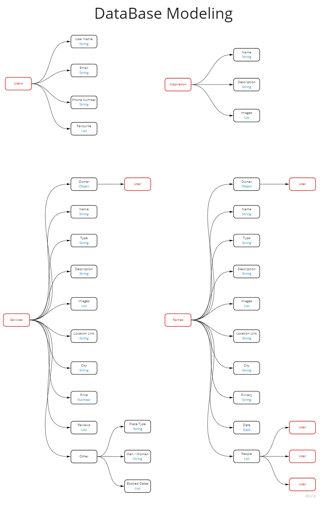

<!-- @format -->

# Project Name

**Partyistic**

&nbsp;

## Team Members

• **Ruba Kannan**

• **Nura Tabanjeh**

• **Firas Hasan**

• **Mahmoud Salameh**

• **Laith Hussein**

• **Yahia Qous**

&nbsp;

# Project Description

The project aims to make party planning much faster and easier than the ordinary methods that take a lot of time and effort, by connecting the user with anything they need to hold the perfect party, such as venues, music bands, fashion, car rental companies, making invitation cards and more.

&nbsp;

## Deployment 

- Netlify: <https://partyistic.netlify.app>
- Heroku API: <https://partyistic.herokuapp.com/api/v1/partyistic>
- ElephantSQL: <https://api.elephantsql.com/console/17f05a8c-9532-4068-b2aa-1e41f9475799/browser>

&nbsp;

## Backend Repo

<https://github.com/partyistic/partyistic-backend>

&nbsp;

## Project Management Tool

<https://trello.com/b/AjJxQRxS/partyistic>

&nbsp;

## Wireframes

<https://wireframepro.mockflow.com/space/M1SwZyI53h>

&nbsp;

## Domain Modeling

&nbsp;

## DataBase Modeling

